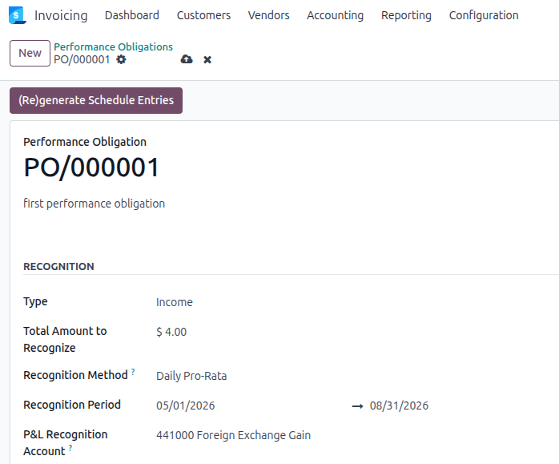
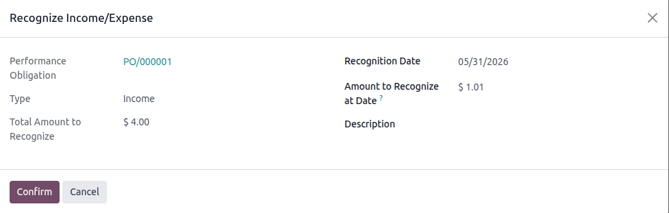

## Configure the obligation

Open a performance obligation and set the following fields:

- **Recognition at Date Method**: select *Daily Pro-Rata*.
- **Start Date** and **End Date**: required when the daily pro-rata method
  is selected.

## Recognize income or expense manually

Open the **Recognize Income** (or **Recognize Expense**) wizard.

The **Amount to Recognize** field is automatically pre-filled based on the
selected date and the obligation's date range. You can adjust the amount
before confirming.

## Generate the recognition schedule

From the obligation form, click **Generate Schedule Entries**.

Draft entries are created for each month-end between the start and end dates,
skipping periods already covered by posted entries.

> If the end date is shortened to before the last posted entry, a single
> corrective draft entry is generated to unwind the excess — posted entries
> are never modified.

## Keep the schedule in sync

Changes to start date, end date, total amount, recognition method, or linked
journal items automatically flag the obligation via **Schedule Needs Regeneration**.

To rebuild the schedule for all flagged obligations, go to
*Invoicing > Accounting > Performance Obligations*, apply the
**Needs Regeneration** filter, select the obligations, and run
**Regenerate Schedule** from the *Action* menu.

Alternatively, install `account_perf_obligation_auto_schedule` to have
flagged obligations processed automatically and asynchronously.
